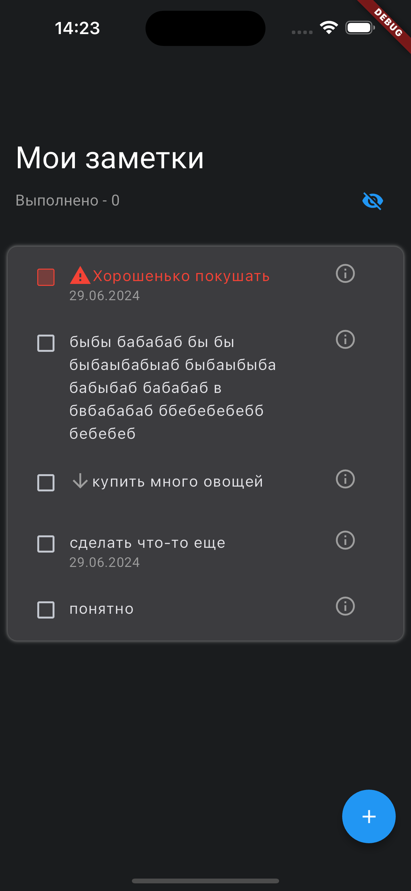
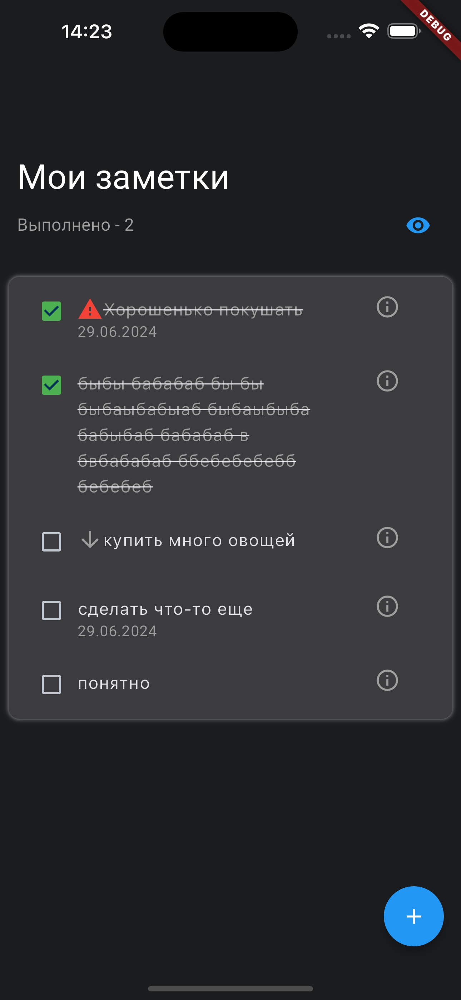
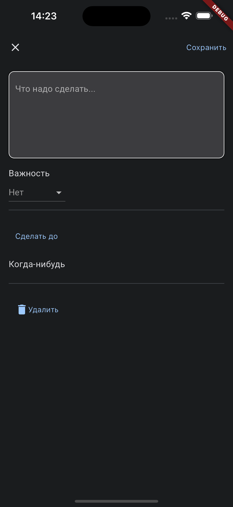

# Simple Notes
Простой проект приложения заметок на Flutter.

## CI/CD с Docker

Проект использует Docker-контейнеры для автоматизации CI/CD процессов:
- **Analyzer** - статический анализ кода
- **Test** - unit-тесты с coverage
- **Builder** - сборка production APK
- **Integration** - интеграционные тесты

### Локальные команды

```bash
make analyze      # Анализ кода
make test         # Unit-тесты
make builder      # Сборка APK
make all          # Полный pipeline
make parallel     # Analyzer + Test параллельно
```

Подробнее: [.github/README.md](.github/README.md)

## Фичи приложения
<ul>
<li>Список с заметками</li>
<li>Свайп заметок для прочтения/удаления</li>
<li>Добавление новых заметок</li>
<li>Изменение заметок</li>
<li>Хранение данных на бэкенд-сервере</li>
<li>Хранение данных в локальном хранилище</li>
<li>Интернационализация</li>
<li>Реализованы Unit-тесты</li>
<li>Реализован интеграционный тест добавления заметки</li>
<li>Добавлены диплинки</li>
</ul>




## Как использовать

### Скачать .apk файл из релизов
[Вот тут](https://github.com/aNOOBisTheGod/ada-lovelace/releases) можно найти все релизы приложения, они будут обновляться автоматически, как только будут заливаться изменения в репозиторий
[Ссылка чтобы стать тестировщиком Firebase Distribution](https://appdistribution.firebase.dev/i/8334066ced40a1b6)

### Клонировать проект и скомпилировать свой Android-релиз
Чтобы клонировать проект, установите Flutter и Git и следуйте этому гайду:
```
git clone https://github.com/aNOOBisTheGod/SimpleNotes.git
cd SimpleNotes
flutter build apk --release 
```

